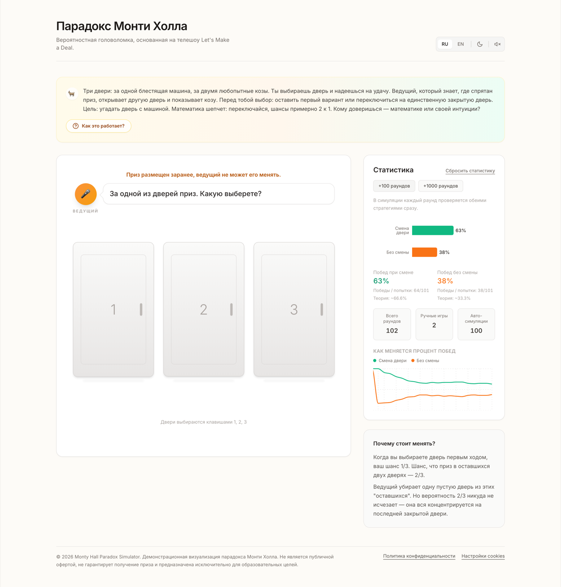

# Monty Hall Paradox Simulator

Interactive **Monty Hall problem** simulator: play the three-door game by hand,
then run 100 or 1000 automated rounds and watch the win rate converge to
**~2/3 for switching** and **~1/3 for staying**.

Live demo: **[montyhall.ru](https://montyhall.ru/)** ·
Runs fully in the browser — no backend, no accounts, no tracking without consent.



## Why this exists

The Monty Hall problem is famous for being counter-intuitive: almost everyone
first answers "50/50". Reading the proof rarely helps — playing a few rounds and
then watching a thousand simulated ones does. This simulator puts the game, the
math and the live statistics on one screen.

## Features

- **Play by hand** — pick a door, the host opens an empty one, decide to switch or stay.
- **Fast simulation** — +100 / +1000 rounds with visible progress and a cancel button.
- **Live statistics** — win rate per strategy, wins/attempts, and a chart of how the
  rate converges to the theoretical 66.6% / 33.3%.
- **Bilingual** — Russian and English, switchable at runtime.
- **Light and dark themes**, following the system preference on first visit.
- **Keyboard accessible** — doors are real buttons, `1` `2` `3` pick a door,
  `Enter` starts the next round, focus is always visible.
- **Offline single-file build** — one self-contained `.html` you can email to someone.
- **Privacy-first analytics** — the Yandex Metrica tag is not loaded until the
  visitor explicitly accepts it.

## Tech stack

| Layer | Choice |
|---|---|
| Language | TypeScript 5.8 (`strict`) |
| UI | React 19 |
| Build | Vite 6 |
| Styling | Tailwind CSS 3, compiled locally via PostCSS + autoprefixer (no CDN) |
| Charts | recharts 3 |
| Offline build | vite-plugin-singlefile |
| Storage | `localStorage` — stats and settings, no server |
| Package manager | npm |

No backend, no database, no environment variables.

## Quick start

```bash
git clone git@github.com:Feyur/montyhall.git
cd montyhall
npm install
npm run dev          # http://localhost:3000
```

Other commands:

```bash
npm run typecheck      # tsc --noEmit, strict mode
npm run build          # production site into dist/
npm run build:offline  # single self-contained HTML file, see below
npm run preview        # serve the production build locally
```

There is no automated test suite yet; `npm run typecheck` plus a manual pass in
the browser is the current verification (see `AGENTS.md`).

## Single-file offline build

```bash
npm run build:offline
```

Produces `dist-offline/Парадокс Монти Холла.html` (~1.4 MB) with all code,
styles, images and sounds inlined. Double-click it and the simulator opens in the
browser — no internet, no server, no installation. The file makes **zero external
requests**.

Differences from the hosted version: no analytics, no cookie banner and no links
to site pages (`IS_OFFLINE_BUILD` in `lib/env.ts`), and the system font replaces
Inter. Stats persist in `localStorage`; Safari blocks that for `file://` pages, so
there the results simply reset between launches — everything else works.

## Project structure

```
index.html            page shell, SEO markup and a no-JS static fallback
index.tsx             entry point: mounts React, imports index.css
index.css             Tailwind layers, focus styles, 3D door utilities, reduced-motion
App.tsx               screen composition and game state
components/
  GameBoard.tsx       host line, doors, decision buttons
  Door.tsx            a single door: 3D flip, states, accessibility
  StatsBoard.tsx      statistics and charts
  HowItWorksModal.tsx rules dialog (Esc, focus trap)
  CookieBanner.tsx    analytics consent
lib/
  game.ts             pure round logic and fast simulation
  stats.ts            statistics math and chart history
  storage.ts          localStorage with validation
  analytics.ts        Yandex Metrica loader and consent storage
  sounds.ts           round outcome sounds
  env.ts              offline-build flag
assets/               door images and sounds
public/               icons, manifest, robots/sitemap, privacy.html
docs/                 screenshot for this README
rules/                engineering rules for humans and AI agents
```

Dependencies point one way: components → `lib/` → browser APIs. The game logic in
`lib/game.ts` knows nothing about React.

## How the statistics are counted

- **Rounds played** — how many times the puzzle was played.
- A manual round adds one attempt to the strategy the player picked.
- A simulated round adds one attempt to **both** strategies: the same round is
  evaluated as "stay" and as "switch", which is why the two attempt counters add
  up to more than the number of rounds. That is intentional — it compares the
  strategies on identical rounds.
- Percentages are computed per strategy attempts, not per total rounds.

Stats and settings (language, theme, sound) live in `localStorage` and survive a
reload.

## Privacy

The Yandex Metrica tag is only injected after the visitor presses "Allow
analytics". Declining reloads the page without the counter, and the "Cookie
settings" link in the footer brings the banner back. Policy text lives in
`public/privacy.html`.

## Deployment

`npm run build` outputs static files to `dist/`; their contents go into
`public_html` on the host. Server credentials are kept outside the repository and
never committed.

## Keywords

Monty Hall problem, Monty Hall paradox, Monty Hall simulator, three doors problem,
conditional probability, Bayes theorem demo, probability simulation, statistics
visualization, Monte Carlo simulation, math education, interactive explainer,
React, TypeScript, Vite, Tailwind CSS, recharts, offline single-file app,
парадокс Монти Холла, симулятор вероятностей, теория вероятностей.
